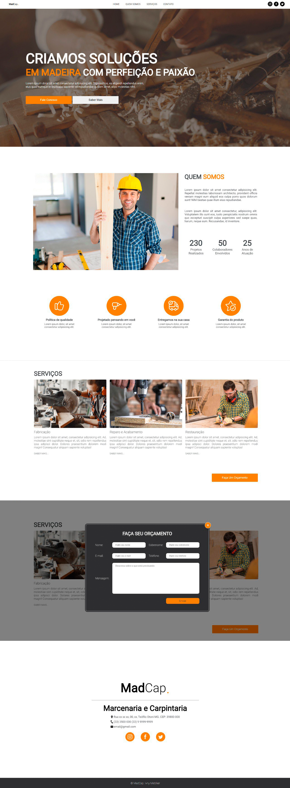

# MadCap - Landing Page

## 📎 About / Sobre

The project consists of creating a landing page for a fictional joinery and carpentry shop that offers craft products and services, called MadCap.
>O projeto consiste na criação de uma landing page estática para uma marcenaria e carpintaria fictícia que oferece produtos e serviços de trabalhos manuais, chamada MadCap.

## 🛸 Technologies Used / Tecnologias Utilizadas

- HTML 5
- CSS 3
- JAVA SCRIPT

## 🖥️ Demonstração / Demonstration

## 🔗 Link da Página / Page Link

<a href="https://madcap-by-imetzker.netlify.app/" rel="Site" target="_blank">Clique aqui para ir para o projeto em execução</a>

## 👾 Créditos

Desenvolvido por: <a href="https://github.com/iMetzker">Ivny Metzker</a>  